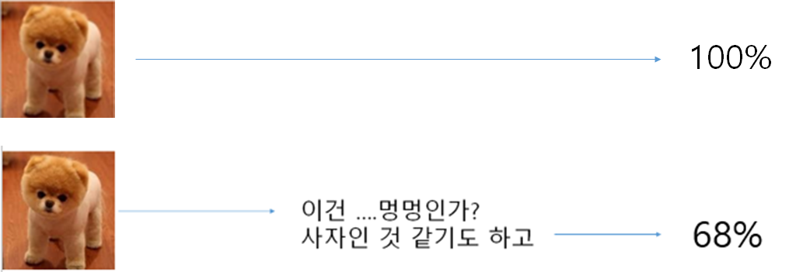
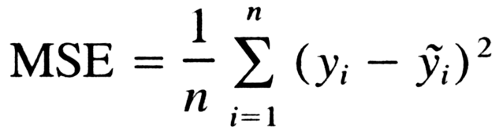
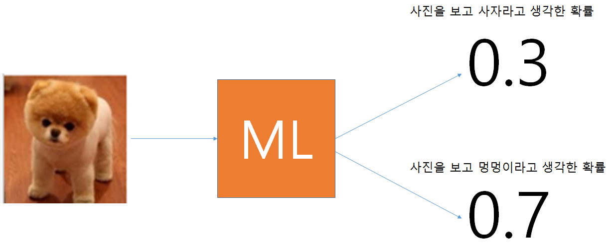

# DeepLearning_from_scratch Lesson2

 

이미 주어진 정답과 머신러닝이 예상한 값의 차이은 어떻게 계산해야 할까요?

단순히 빼기를 해야할까요?

많은 방법이 있지만 우리는 아래와 같은 방법을 사용해 계산합니다.

MSE (Mean Squared Error)



아래와 같은 함수를 만들어 봅시다

```python
def mean_squared_error(y,t):
  return 0.5*np.sum((y-t)**2)
```

이함수는 두 Matrix간의 차이를 계산합니다

아래와 같이 두 Matrix을 Numpy을 이용해 정의해보죠

```python
t=np.array([0,1])
p=np.array([0.3,0.7])
```
주의 할 점은 두 Matrix의 합이 1이 되어야 합니다



그럼 MSE을 이용해 차이를 계산해보죠.

```python
0.090000000000000011
```
앞으로 우리가 만든 ML은 이 차이를 줄이기 위해 Weights 와 Biases을 수정 할 것입니다

##CrossEntropy(CEE)을 이용한 LossFunction 계산
